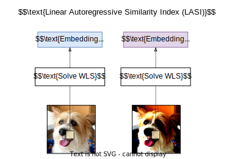

# The Unreasonable Effectiveness of Linear Prediction as a Perceptual Metric
Daniel Severo, Lucas Theis, Johannes Ballé

🎉 Accepted to ICLR 2024 🎉

[](https://github.com/dsevero/Linear-Autoregressive-Similarity-Index/actions/workflows/tests.yml)

[](https://arxiv.org/abs/2310.05986)

<p align="justify">
We show how perceptual embeddings of the visual system can be constructed at inference-time with no training data or deep neural network features. Our perceptual embeddings are solutions to a weighted least squares (WLS) problem, defined at the pixel-level, and solved at inference-time, that can capture global and local image characteristics. The distance in embedding space is used to define a perceptual similary metric which we call LASI: Linear Autoregressive Similarity Index. Experiments on full-reference image quality assessment datasets show LASI performs competitively with learned deep feature based methods like LPIPS (Zhang et al., 2018) and PIM (Bhardwaj et al., 2020), at a similar computational cost to hand-crafted methods such as MS-SSIM (Wang et al., 2003). We found that increasing the dimensionality of the embedding space consistently reduces the WLS loss while increasing performance on perceptual tasks, at the cost of increasing the computational complexity. LASI is fully differentiable, scales cubically with the number of embedding dimensions, and can be parallelized at the pixel-level. A Maximum Differentiation (MAD) competition (Wang & Simoncelli, 2008) between LASI and LPIPS shows that both methods are capable of finding failure points for the other, suggesting these metrics can be combined.
</p>

# How to use the Linear Autoregressive Similarity Index (LASI)
This example can be run in the following notebook: [](https://colab.research.google.com/github/dsevero/Linear-Autoregressive-Similarity-Index/blob/main/Linear-Autoregressive-Similarity-Index.ipynb).

```python3
from PIL import Image
from lasi import LASI
import jax
import jax.numpy as jnp

# Load images.
img_megg = jnp.array(Image.open('assets/megg.png').convert('RGB'))
img_dark_megg = jnp.array(Image.open('assets/dark-megg.png').convert('RGB'))
assert img_dark_megg.shape == img_megg.shape

# Compute the distance between img_megg and img_dark_megg.
lasi = LASI(img_megg.shape, neighborhood_size=10)
distance = jax.jit(lasi.compute_distance)(img_megg, img_dark_megg)
print(f'd(img_megg, img_dark_megg) = {distance}')

# Efficiently compute the distance between multiple images relative to a reference (img_megg).
# This function jits internally.
img_megg_offset = jnp.clip(img_megg + 20, 0 ,255)
distances = lasi.compute_distance_multiple(
    ref=img_megg, p0=img_dark_megg, p1=img_megg_offset)
print(f"d(ref, p0) = {distances['p0']}")
print(f"d(ref, p1) = {distances['p1']}")
```

See `tests.py` as well as docstrings in `lasi/lasi.py` for more examples.
